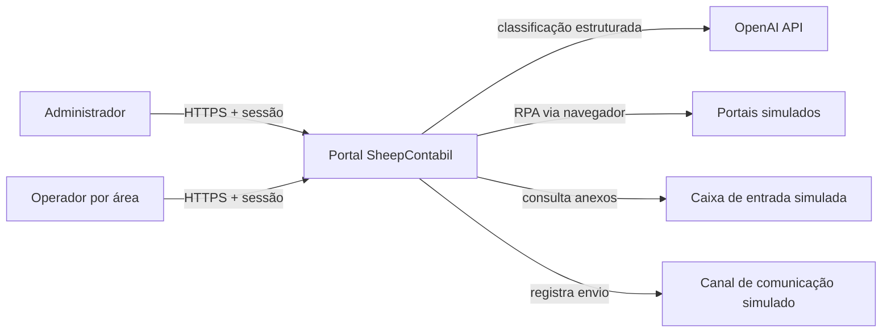
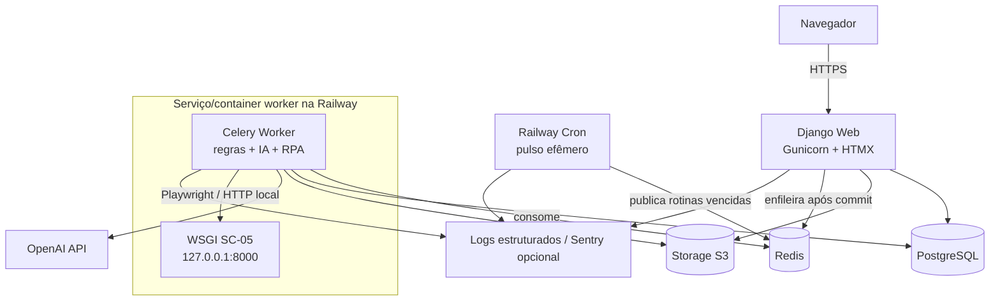

# Arquitetura de software — SheepContabil

| Campo | Valor |
| --- | --- |
| Status | Baseline vigente, atualizada com a implementação do Dia 5 |
| Data da baseline | 2026-08-27 |
| Última atualização | 2026-09-01 |
| Escopo funcional | SC-04, SC-05, SC-06 e SC-20 |
| Horizonte | Entrega pública e demonstrável em uma semana |

## 1. Objetivo

Esta arquitetura orienta a implementação do portal SheepContabil e das quatro automações selecionadas. Ela prioriza entrega ponta a ponta, rastreabilidade, falha controlada e substituição futura das integrações simuladas.

A solução é um **monólito modular Django**, entregue como uma única unidade de software, mas executado por processos distintos de web, worker e scheduler. A separação de processos não transforma o sistema em microsserviços: todos compartilham código, modelo de domínio, banco, ciclo de versão e implantação. O SC-05 acrescenta um processo WSGI privado de demonstração exclusivamente como fronteira externa sintética; ele não contém a orquestração de negócio. No Compose esse processo fica em contêiner próprio; na Railway ele é co-localizado no contêiner do worker para respeitar o limite de recursos do plano.

## 2. Diretrizes

1. A fronteira externa pode ser simulada; validação, classificação, decisão, cálculo, orquestração, persistência e tratamento de erro devem ser reais.
2. PostgreSQL é a fonte de verdade. Redis transporta trabalhos, mas não conserva o histórico oficial.
3. Toda automação, manual ou agendada, usa o mesmo caso de uso e produz uma execução auditável.
4. Nenhum resultado externo é considerado confiável antes de validação.
5. Falha de integração nunca é apresentada como resultado negativo de negócio.
6. Regras variáveis pertencem a dados/configuração, não a condicionais dispersas na interface.
7. Operações irreversíveis ou de baixa confiança exigem controle explícito, revisão ou compensação.
8. A arquitetura deve caber no prazo; complexidade operacional só é aceita quando atende requisito demonstrável.

## 3. Visão de contexto



OpenAI e os simuladores são dependências substituíveis, acessadas somente por adapters. O domínio não conhece SDKs, URLs, seletores ou credenciais.

## 4. Visão de contêineres e processos



### 4.1 Processos de runtime

| Processo | Responsabilidade | Escala inicial |
| --- | --- | --- |
| `web` | Autenticação, autorização, páginas, comandos, consulta de histórico e downloads autorizados | 1 réplica |
| `worker` | Execuções demoradas, classificação, OCR, RPA, notificações e geração de artefatos; na Railway também hospeda o processo auxiliar WSGI sintético | 1 réplica, concorrência baixa |
| `cron` | Pulso efêmero que identifica e publica execuções vencidas | 1 execução por pulso |
| `simulator` WSGI | Três portais HTML sintéticos do SC-05, com autenticação própria e falhas determinísticas | Contêiner separado no Compose; subprocesso local do `worker` na Railway |

Web, worker e cron usam a mesma versão do código. O simulador usa a mesma imagem e banco nesta entrega curta, mas mantém URLconf, settings e entrypoint WSGI próprios e não é um serviço de domínio da SheepContabil. Na Railway, o Playwright o acessa por `127.0.0.1:8000`; a porta também escuta na rede privada somente para o healthcheck da plataforma, sem domínio público. Um supervisor valida schema, inicia o WSGI com ambiente sanitizado, confirma liveness, inicia Celery e só então libera readiness; a saída de qualquer filho encerra o outro para que o serviço seja reiniciado de forma coerente.

A co-localização é decisão operacional, não quebra da fronteira lógica: o subprocesso recebe somente runtime Python, segredo Django, fuso, PostgreSQL e credenciais sintéticas. Redis, S3 e OpenAI permanecem fora de seu ambiente. No Compose, onde não existe o mesmo limite de recursos, o contêiner `simulator` continua separado e acessível ao worker apenas pela rede interna.

## 5. Organização modular

```text
src/
├── config/                 # settings, URLs e entrypoints web/simulador
├── core/
│   ├── identity/           # usuário, sessão, áreas e políticas
│   ├── automations/        # execução comum e domínios SC-04/05/06/20
│   │   └── sc05/           # saga, ports, Playwright e screenshots
│   └── sc05_simulator/     # estado e páginas HTML dos três portais
├── templates/              # páginas e componentes HTMX
├── static_src/             # fontes do design system SheepContabil
└── static/                 # assets compilados e marca
```

Regras de dependência:

- módulos podem depender de contratos estáveis em `core`;
- `core` não depende de módulos;
- um módulo não acessa tabelas ou serviços internos de outro módulo;
- SDKs externos, Playwright e S3 aparecem apenas na camada de adapters;
- views não contêm regras de negócio;
- tarefas Celery chamam casos de uso e não duplicam regras;
- consultas de dashboard podem ler projeções próprias, sem alterar o domínio.

## 6. Modelo comum de execução

Toda execução possui, no mínimo:

- UUID;
- código do módulo;
- origem `MANUAL` ou `SCHEDULED`;
- usuário ou ator de sistema;
- parâmetros normalizados;
- chave de idempotência;
- início, fim e duração;
- estado atual;
- resumo de resultado;
- mensagem de erro segura para o usuário;
- correlação com logs, etapas e artefatos.

Estados iniciais:

```text
PENDING -> QUEUED -> RUNNING -> SUCCEEDED
                           |-> SUCCEEDED_WITH_WARNINGS
                           |-> AWAITING_REVIEW -> SUCCEEDED
                           |-> PARTIALLY_FAILED
                           |-> FAILED
PENDING/QUEUED/RUNNING -> CANCELLED (quando seguro)
```

Cada transição é validada no backend. Exceções técnicas não são exibidas ao usuário. Uma execução registra etapas individualmente, inclusive retentativas e compensações.

### 6.1 Disparo manual

1. O backend autentica e autoriza o usuário para o módulo.
2. Valida a entrada e cria `AutomationRun` em transação.
3. Publica a tarefa somente depois do commit.
4. Retorna a página da execução imediatamente.
5. HTMX atualiza estado, etapas e resultado por polling.
6. O worker persiste cada transição e artefato.

### 6.2 Disparo agendado

Um Railway Cron executa um pulso curto a cada 15 minutos. O comando consulta no PostgreSQL o que venceu segundo `America/Sao_Paulo`, cria a chave idempotente e publica SC-04 diariamente e SC-20 mensalmente no Redis. O agendador chama o mesmo serviço de aplicação usado pelo comando manual, com ator de sistema. Assim, o cron da plataforma não codifica a regra de cada cliente e uma oscilação de minutos não muda a competência.

## 7. Persistência

### 7.1 PostgreSQL

PostgreSQL conserva identidade, clientes sintéticos, módulos, execuções, etapas, auditoria e dados funcionais. As tabelas usam UUID, constraints, índices e timestamps UTC. JSONB é reservado a snapshots e estruturas legitimamente flexíveis, não ao domínio inteiro.

Redis não é usado como fonte de verdade nem como histórico de resultado. Estado oficial de Celery também não substitui `AutomationRun`.

### 7.2 Storage S3

Arquivos originais, screenshots, relatórios e downloads ficam em storage compatível com S3. O banco guarda metadados, hash SHA-256 e chave do objeto. No SC-05 cada screenshot PNG pertence a uma tentativa específica e usa chave determinística sob o UUID da execução. O disco do contêiner é apenas temporário.

Downloads passam por autorização e usam URL assinada de curta duração ou proxy do backend. Nomes originais não são usados como chaves. Originais relevantes para auditoria são imutáveis.

## 8. Identidade, autenticação e autorização

Django fornece autenticação por usuário e senha, sessão em cookie e proteção CSRF. Será criado um modelo de usuário próprio desde a primeira migração, mesmo que inicialmente tenha poucos campos.

RBAC combina:

- papel `ADMINISTRATOR`, com acesso funcional a todos os módulos;
- papel `OPERATOR`, condicionado a áreas/módulos concedidos;
- políticas verificadas no servidor para páginas, comandos, arquivos e endpoints HTMX.

Ocultar navegação é apenas experiência visual; nunca substitui autorização. A interface administrativa do produto é SheepContabil. Django Admin, se habilitado, é ferramenta de manutenção e não a experiência principal.

Controles mínimos:

- cookie `HttpOnly`, `Secure` e `SameSite=Lax`;
- expiração de sessão e logout;
- hash de senha forte;
- CSRF;
- limitação de tentativas de login;
- segredos apenas em variáveis da plataforma;
- credenciais de demonstração fora do repositório.

## 9. Frontend

Django Templates renderiza as páginas; HTMX realiza atualizações parciais, submissões e polling; Alpine.js é limitado a comportamento local de interface. Tailwind CSS implementa tokens e componentes da identidade SheepContabil.

Não há SPA nem estado de domínio duplicado no navegador. Componentes entregues ao longo dos cinco dias:

- shell, navegação e home de módulos;
- tabela e filtros de execuções;
- timeline de etapas;
- upload e preview;
- revisão humana lado a lado;
- formulários condicionais;
- alertas, estados vazios e mensagens de erro;
- download autorizado de artefatos.

## 10. Arquitetura por processo

### 10.1 SC-04 — Triagem inteligente de arquivos

Fluxo:

1. O adapter da caixa simulada fornece somente anexos ainda não ingeridos.
2. A ingestão detecta duplicidade por ID da origem e hash.
3. O sistema extrai texto e metadados; OCR é usado quando necessário.
4. O port `DocumentClassifier` envia conteúdo minimizado ao adapter OpenAI.
5. A resposta estruturada é validada e normalizada.
6. A política interna cruza tipo, cliente, evidências e confiança.
7. Alta confiança permite roteamento; ambiguidade cria revisão humana.
8. Original, predição, versão de prompt/modelo e correção ficam vinculados.

O modelo nunca escreve diretamente no banco nem move arquivos. Ausência, timeout ou resposta inválida do provedor produz falha compreensível ou revisão, nunca sucesso fabricado.

### 10.2 SC-05 — Bloqueio e desbloqueio

O worker usa Playwright Chromium contra páginas HTML autenticadas, preservando a natureza RPA. Não há chamada a endpoint oculto nem alteração direta no banco do simulador: o adapter autentica, lê estado visível, preenche os controles e aciona formulários com CSRF. Os três gateways compartilham um navegador, um contexto e uma página por saga; a API síncrona do Playwright roda em uma thread dedicada para não misturar seu event loop com o contexto do worker e o acesso ORM.

A ordem foi congelada a partir de reversibilidade e risco:

| Ação | Ordem |
| --- | --- |
| Bloquear | Portal de arquivos → Sistema contábil → Sistema de tarefas |
| Desbloquear | Sistema de tarefas → Sistema contábil → Portal de arquivos |

O sistema de tarefas preserva a exceção obrigatória do desafio. O adapter lê do DOM o estado ativo do cliente e as ações nunca o alteram; somente tarefas abertas recebem o responsável `BLOQUEADO_INADIMPLENCIA`. Tarefas fechadas não são alteradas. O estado anterior — inclusive cada responsável afetado — é conservado para desbloqueio e compensação exatos; se esse snapshot não existir, o desbloqueio é recusado em vez de inventar um destino. O undo restaura responsáveis sem congelar o ciclo de vida: fechamento posterior e tarefas novas normais são preservados, enquanto referência ausente, marcador inesperado ou reatribuição por terceiro gera conflito.

Arquivos e Contábil também desfazem para o booleano capturado na última saga de bloqueio bem-sucedida. Assim, uma conta que já estava bloqueada por outro motivo antes do SC-05 não é ativada indevidamente na renegociação.

A orquestração implementada é uma saga persistida:

1. bloquear o cliente no banco para impedir duas operações concorrentes e materializar as três etapas;
2. capturar o estado visível anterior de cada portal;
3. derivar e persistir o estado desejado, sem confiar apenas na resposta do clique;
4. não executar mutação quando o portal já estiver conforme;
5. aplicar a ação e confirmar novamente o estado pela interface;
6. registrar tentativa, estado antes/depois, duração, erro seguro e screenshot privado por interação concluída ou recusada;
7. em falha, inspecionar de novo e compensar passos alterados em ordem inversa;
8. restaurar somente quando o estado atual ainda for exatamente o produzido pela saga, evitando sobrescrever mudança externa;
9. finalizar como `FAILED` quando toda compensação restaurar o estado inicial ou como `PARTIALLY_FAILED` quando houver resíduo;
10. permitir retomada explícita apenas da falha parcial, preservar o evento e cenário original e não repetir mutação já conforme.

`SC05Client`, `SC05Operation` e `SC05PortalStep` formam a projeção operacional. `SC05StepAttempt` conserva as tentativas de inspeção, aplicação e compensação; tentativas finalizadas e artefatos rejeitam edição/exclusão pela instância, e o admin os expõe somente para leitura. `SC05Artifact` referencia o objeto privado com hash e tamanho, ambos verificados novamente no download. Cada imagem contém somente o cartão do cliente-alvo ou o alerta de falha. Entregas repetidas do broker encerram tentativas interrompidas de forma explícita antes de reconciliar, mas um caso já parcial só volta a executar após retomada autorizada.

O simulador privado implementa fluxo normal e três cenários controlados: falha na aplicação em Tarefas, timeout na aplicação do Contábil e falha combinada em Tarefas com falha de compensação em Arquivos. Somente o administrador escolhe falhas; o operador Tecnologia usa o caminho normal. URLs, credenciais, timeout e seletores não escapam para o serviço da saga, e a troca futura por sistemas reais permanece concentrada nos gateways. Em produção, suas credenciais existem somente nas variáveis do `worker` e o gateway usa o endereço loopback; em desenvolvimento, a URL aponta para o serviço Compose separado.

### 10.3 SC-06 — Briefing societário

O formulário é dirigido por template versionado. Perguntas, opções, obrigatoriedade, visibilidade e validação são persistidas como configuração. A primeira DSL é deliberadamente pequena: igualdade, diferença, pertencimento, `all` e `any`.

O frontend reage às regras para usabilidade, mas o servidor reavalia todas elas no envio. Cada briefing aponta para a versão imutável do template usada, garantindo leitura histórica correta.

A versão implementada separa quatro responsabilidades:

- `rules.py` valida o schema, interpreta condições, normaliza respostas ativas e formata o resultado sem importar view ou infraestrutura;
- `services.py` fixa a versão publicada, cria o briefing e a execução na mesma transação, salva rascunhos e conclui sob lock de linha;
- o formulário Django cria somente tipos de campo permitidos e o Alpine replica a reação visual usando a configuração entregue pelo servidor;
- `pdf.py` deriva o documento consolidado do briefing concluído e imutável, sem criar outra fonte de verdade.

Uma versão publicada não pode mudar schema, identidade, estado ou autoria. Um briefing concluído também protege versão, execução, cliente, respostas, autor da abertura, autor e data da conclusão. A evidência concluída é append-only: edição e exclusão individual ou em lote são bloqueadas no domínio, além dos controles do admin. Evolução de perguntas cria uma nova versão e não altera a interpretação dos casos existentes.

O estado comum fica coerente com o caso: criação abre uma `AutomationRun` manual em `RUNNING`; rascunhos atualizam resumo e contagem; uma conclusão válida grava briefing, ator da conclusão e execução `SUCCEEDED` atomicamente. Campos desconhecidos, ocultos por mudança de caminho ou pertencentes a outra ramificação são descartados pelo servidor. Valores sem representação canônica são recusados na publicação do schema para manter a mesma semântica no Python e no navegador.

### 10.4 SC-20 — Certificados digitais

A execução mensal identifica certificados dentro da janela documental de 60 dias. Seleção, deduplicação, registro de comunicação e tratamento de falha são internos; apenas o envio é simulado por adapter.

A mesma comunicação não é repetida sem mudança relevante de validade, estado, canal ou política. O disparo manual usa a mesma lógica e também respeita idempotência.

## 11. Integrações e adapters

Ports iniciais:

- `DocumentInbox`;
- `DocumentClassifier`;
- `ObjectStorage`;
- `PortalGatewaySession` e um `PortalGateway` por sistema do SC-05;
- `NotificationGateway`;
- `Clock` para regras temporais testáveis.

Cada adapter deve ter testes de contrato. Fakes são permitidos em testes, mas o ambiente demonstrável não pode trocar uma automação por resposta estática.

## 12. Resiliência e auditoria

- retentativa somente para erros transitórios;
- backoff exponencial com jitter;
- timeout por integração e etapa;
- reconciliação de execuções presas;
- idempotência no domínio e nas integrações;
- falha parcial explícita;
- screenshot privado recortado e snapshot de estado por interação RPA concluída ou recusada;
- hash e preservação do documento original;
- eventos de auditoria append-only para ações relevantes;
- mensagem operacional separada do detalhe técnico.

## 13. Observabilidade

Logs JSON em stdout contêm `request_id`, `run_id`, `module_code`, `user_id`, `client_id`, `step` e `attempt` quando aplicável. O portal apresenta histórico operacional; logs e Sentry opcional atendem diagnóstico técnico.

Endpoints:

- `/health/live`: processo responde;
- `/health/ready`: dependências essenciais disponíveis.

Não serão introduzidos Prometheus, Grafana ou tracing distribuído no prazo inicial.

## 14. Conteinerização e ambientes

Docker multi-stage compila assets e instala dependências travadas. A imagem roda como usuário não-root. Web, worker e cron usam comandos diferentes da mesma imagem; o worker inclui as dependências de navegador necessárias ao Playwright.

Docker Compose reproduz localmente web, worker, simulador SC-05, PostgreSQL, Redis e storage S3 compatível. O simulador publica `127.0.0.1:8010` apenas para inspeção local e o worker o acessa pelo nome privado `simulator`. Ele recebe um ambiente mínimo próprio, sem credenciais Redis, S3 ou OpenAI. O mesmo comando efêmero usado pelo Railway Cron pode ser executado sob demanda no ambiente local. Migrations rodam em etapa explícita, não na inicialização concorrente de cada réplica.

Na Railway, o limite do plano muda somente a unidade de hospedagem: `scripts/run_worker_with_simulator.sh` mantém Celery e o WSGI sintético como processos independentes no mesmo contêiner. `env -i` reduz a herança acidental de variáveis, o Playwright usa loopback, não existe domínio público e a credencial SC-05 fica cadastrada apenas no `worker`. Isso não constitui uma fronteira de segurança forte: os processos compartilham UID, namespace e credencial ampla de banco. Essa adaptação não deve ser copiada para uma produção com capacidade para isolamento de serviço; separar novamente o simulador é o caminho preferido quando o limite deixar de existir.

Ambientes:

- `local`: Compose e dados sintéticos;
- `test`: serviços efêmeros e relógio controlado;
- `production`: Railway, somente dados sintéticos do desafio.

## 15. Implantação Railway

Um projeto Railway conterá:

- serviço web público;
- worker privado, com Celery e processo auxiliar WSGI do SC-05 no mesmo contêiner;
- cron privado e efêmero, com pulso de 15 minutos;
- PostgreSQL gerenciado;
- Redis;
- bucket S3.

O PR `#5` incorporou a 0.5.0 à `main`; os CIs do PR e do push em `main` ficaram verdes e a integração nativa concluiu deployments de `web`, `worker` e `scheduler` condicionados ao **Wait for CI**. O plano disponível, porém, não permitiu criar um quarto serviço de aplicação, e por isso essa implantação não tornou o SC-05 operacional. A IaC foi reduzida aos três serviços existentes e o ajuste co-localizado ainda precisa de novo PR, CI, deploy do worker e smoke tests. Até esses gates, a 0.5.0 está publicada, mas a automação SC-05 permanece sem evidência pública ponta a ponta.

O web recebe o domínio HTTPS gerado pela plataforma. Domínio próprio é opcional e só será configurado se já estiver sob controle do projeto. O serviço permanecerá em plano sem suspensão durante toda a avaliação.

Deploy da branch `main` ocorre somente após validação no CI. A etapa de release executa migrations; depois, um smoke test consulta `health/ready` e autenticação. Backups do banco e restauração documentada fazem parte da preparação final.

## 16. Testes mínimos

- unitários: regras, estados, autorização, confiança, saga, formulário e janela temporal;
- integração: PostgreSQL, Redis/Celery, S3 e adapters;
- contrato: cada port contra sua implementação simulada;
- E2E: login/RBAC e um caminho crítico por módulo;
- resiliência: timeout, entrada inválida, duplicidade, falha parcial e retomada.

No Dia 5, 37 testes focados exercitam ordem e idempotência da saga, bloqueio e undo tardio, preservação de restrições anteriores, compensação total e parcial, proteção contra estado divergente, retomada, RBAC, integridade de evidência e falha de broker. Quatro testes de contrato iniciam um servidor real e conduzem Chromium sobre bloqueio, desbloqueio, falha visual e retomada parcial nos três portais HTML. A suíte consolidada aprovou 124 testes com 83,85% de cobertura; lint, formatação, tipagem, sintaxe do supervisor, checks Django, migrations, assets e Compose também passaram. O build de contêiner foi confirmado pelos CIs verdes do PR `#5` e do push em `main`. O deploy atualizado do worker e os smoke tests públicos são gates independentes antes de declarar o SC-05 operacional.

## 17. Decisões explicitamente fora do escopo

Não serão usados no desafio inicial:

- microsserviços de domínio;
- frontend SPA separado;
- JWT em armazenamento do navegador;
- Kubernetes;
- Kafka;
- GraphQL;
- CQRS/event sourcing;
- banco por módulo;
- SQLite em produção;
- arquivos persistentes no disco do contêiner;
- cron embutido no processo web;
- resposta mockada como núcleo de IA/RPA;
- aprovação automática de classificação ambígua.

Os motivos e gatilhos de revisão constam nos ADRs.

## 18. Índice de decisões

- [ADR-0001 — Monólito modular com Django e HTMX](adr/0001-modular-monolith-django-htmx.md)
- [ADR-0002 — PostgreSQL como fonte de verdade](adr/0002-postgresql-source-of-truth.md)
- [ADR-0003 — Celery e Redis para execução assíncrona](adr/0003-celery-redis-jobs-scheduling.md)
- [ADR-0004 — Storage compatível com S3](adr/0004-s3-object-storage.md)
- [ADR-0005 — OpenAI atrás de adapter](adr/0005-openai-classification-adapter.md)
- [ADR-0006 — Playwright para o RPA SC-05](adr/0006-playwright-rpa.md)
- [ADR-0007 — Sessão Django e RBAC por área](adr/0007-authentication-rbac.md)
- [ADR-0008 — Railway como plataforma de hospedagem](adr/0008-railway-hosting.md)
- [ADR-0009 — Decisões arquiteturais evitadas](adr/0009-explicitly-avoided-decisions.md)

Premissas e incertezas estão registradas em [assumptions.md](assumptions.md).
