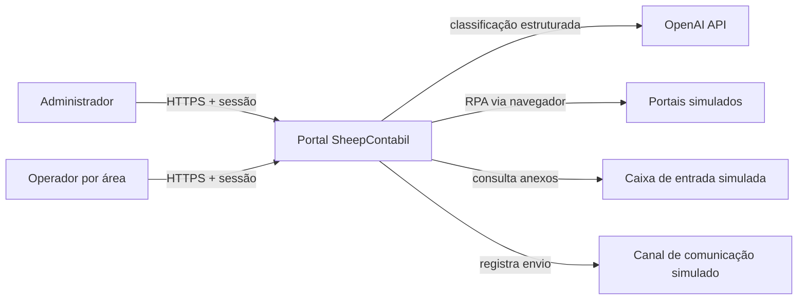
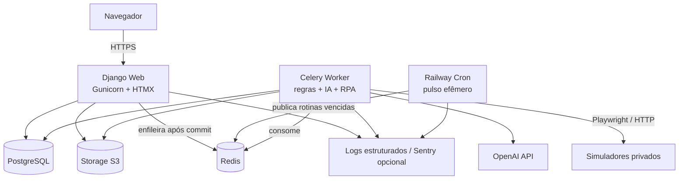

# Arquitetura de software — SheepContabil

| Campo | Valor |
| --- | --- |
| Status | Baseline aprovada para o Dia 1 |
| Data | 2026-08-27 |
| Escopo funcional | SC-04, SC-05, SC-06 e SC-20 |
| Horizonte | Entrega pública e demonstrável em uma semana |

## 1. Objetivo

Esta arquitetura orienta a implementação do portal SheepContabil e das quatro automações selecionadas. Ela prioriza entrega ponta a ponta, rastreabilidade, falha controlada e substituição futura das integrações simuladas.

A solução será um **monólito modular Django**, entregue como uma única unidade de software, mas executado por processos distintos de web, worker e scheduler. A separação de processos não transforma o sistema em microsserviços: todos compartilham código, modelo de domínio, banco, ciclo de versão e implantação.

## 2. Diretrizes

1. A fronteira externa pode ser simulada; validação, classificação, decisão, cálculo, orquestração, persistência e tratamento de erro devem ser reais.
2. PostgreSQL é a fonte de verdade. Redis transporta trabalhos, mas não conserva o histórico oficial.
3. Toda automação, manual ou agendada, usa o mesmo caso de uso e produz uma execução auditável.
4. Nenhum resultado externo é considerado confiável antes de validação.
5. Falha de integração nunca é apresentada como resultado negativo de negócio.
6. Regras variáveis pertencem a dados/configuração, não a condicionais dispersas na interface.
7. Operações irreversíveis ou de baixa confiança exigem controle explícito, revisão ou compensação.
8. A arquitetura deve caber no prazo; complexidade operacional só é aceita quando atende requisito demonstrável.

## 3. Visão de contexto



OpenAI e os simuladores são dependências substituíveis, acessadas somente por adapters. O domínio não conhece SDKs, URLs, seletores ou credenciais.

## 4. Visão de contêineres e processos



### 4.1 Processos de runtime

| Processo | Responsabilidade | Escala inicial |
| --- | --- | --- |
| `web` | Autenticação, autorização, páginas, comandos, consulta de histórico e downloads autorizados | 1 réplica |
| `worker` | Execuções demoradas, classificação, OCR, RPA, notificações e geração de artefatos | 1 réplica, concorrência baixa |
| `cron` | Pulso efêmero que identifica e publica execuções vencidas | 1 execução por pulso |
| `simulator` | Fronteiras sintéticas de caixa de entrada, portais e comunicação | 1 serviço privado |

Web, worker e cron usam a mesma versão do código. O simulador é infraestrutura de demonstração, não um serviço de domínio da SheepContabil.

## 5. Organização modular

```text
src/
├── config/                 # settings, URLs e entrypoints
├── core/
│   ├── identity/           # usuário, sessão, áreas e políticas
│   ├── clients/            # cadastro sintético compartilhado
│   ├── executions/         # execução, etapa, estado e idempotência
│   ├── audit/              # trilha de auditoria
│   ├── files/              # metadados e port S3
│   └── notifications/      # tentativas e port de comunicação
├── modules/
│   ├── sc04_triage/
│   ├── sc05_blocking/
│   ├── sc06_briefing/
│   └── sc20_certificates/
├── simulators/             # implementações sintéticas das fronteiras
├── templates/              # páginas e componentes HTMX
└── static/                 # design system SheepContabil
```

Regras de dependência:

- módulos podem depender de contratos estáveis em `core`;
- `core` não depende de módulos;
- um módulo não acessa tabelas ou serviços internos de outro módulo;
- SDKs externos, Playwright e S3 aparecem apenas na camada de adapters;
- views não contêm regras de negócio;
- tarefas Celery chamam casos de uso e não duplicam regras;
- consultas de dashboard podem ler projeções próprias, sem alterar o domínio.

## 6. Modelo comum de execução

Toda execução possui, no mínimo:

- UUID;
- código do módulo;
- origem `MANUAL` ou `SCHEDULED`;
- usuário ou ator de sistema;
- parâmetros normalizados;
- chave de idempotência;
- início, fim e duração;
- estado atual;
- resumo de resultado;
- mensagem de erro segura para o usuário;
- correlação com logs, etapas e artefatos.

Estados iniciais:

```text
PENDING -> QUEUED -> RUNNING -> SUCCEEDED
                           |-> SUCCEEDED_WITH_WARNINGS
                           |-> AWAITING_REVIEW -> SUCCEEDED
                           |-> PARTIALLY_FAILED
                           |-> FAILED
PENDING/QUEUED/RUNNING -> CANCELLED (quando seguro)
```

Cada transição é validada no backend. Exceções técnicas não são exibidas ao usuário. Uma execução registra etapas individualmente, inclusive retentativas e compensações.

### 6.1 Disparo manual

1. O backend autentica e autoriza o usuário para o módulo.
2. Valida a entrada e cria `AutomationRun` em transação.
3. Publica a tarefa somente depois do commit.
4. Retorna a página da execução imediatamente.
5. HTMX atualiza estado, etapas e resultado por polling.
6. O worker persiste cada transição e artefato.

### 6.2 Disparo agendado

Um Railway Cron executa um pulso curto a cada 15 minutos. O comando consulta no PostgreSQL o que venceu segundo `America/Sao_Paulo`, cria a chave idempotente e publica SC-04 diariamente e SC-20 mensalmente no Redis. O agendador chama o mesmo serviço de aplicação usado pelo comando manual, com ator de sistema. Assim, o cron da plataforma não codifica a regra de cada cliente e uma oscilação de minutos não muda a competência.

## 7. Persistência

### 7.1 PostgreSQL

PostgreSQL conserva identidade, clientes sintéticos, módulos, execuções, etapas, auditoria e dados funcionais. As tabelas usam UUID, constraints, índices e timestamps UTC. JSONB é reservado a snapshots e estruturas legitimamente flexíveis, não ao domínio inteiro.

Redis não é usado como fonte de verdade nem como histórico de resultado. Estado oficial de Celery também não substitui `AutomationRun`.

### 7.2 Storage S3

Arquivos originais, screenshots, relatórios e downloads ficam em storage compatível com S3. O banco guarda metadados, hash SHA-256 e chave do objeto. O disco do contêiner é apenas temporário.

Downloads passam por autorização e usam URL assinada de curta duração ou proxy do backend. Nomes originais não são usados como chaves. Originais relevantes para auditoria são imutáveis.

## 8. Identidade, autenticação e autorização

Django fornece autenticação por usuário e senha, sessão em cookie e proteção CSRF. Será criado um modelo de usuário próprio desde a primeira migração, mesmo que inicialmente tenha poucos campos.

RBAC combina:

- papel `ADMINISTRATOR`, com acesso funcional a todos os módulos;
- papel `OPERATOR`, condicionado a áreas/módulos concedidos;
- políticas verificadas no servidor para páginas, comandos, arquivos e endpoints HTMX.

Ocultar navegação é apenas experiência visual; nunca substitui autorização. A interface administrativa do produto é SheepContabil. Django Admin, se habilitado, é ferramenta de manutenção e não a experiência principal.

Controles mínimos:

- cookie `HttpOnly`, `Secure` e `SameSite=Lax`;
- expiração de sessão e logout;
- hash de senha forte;
- CSRF;
- limitação de tentativas de login;
- segredos apenas em variáveis da plataforma;
- credenciais de demonstração fora do repositório.

## 9. Frontend

Django Templates renderiza as páginas; HTMX realiza atualizações parciais, submissões e polling; Alpine.js é limitado a comportamento local de interface. Tailwind CSS implementa tokens e componentes da identidade SheepContabil.

Não haverá SPA nem estado de domínio duplicado no navegador. Componentes previstos:

- shell, navegação e home de módulos;
- tabela e filtros de execuções;
- timeline de etapas;
- upload e preview;
- revisão humana lado a lado;
- formulários condicionais;
- alertas, estados vazios e mensagens de erro;
- download autorizado de artefatos.

## 10. Arquitetura por processo

### 10.1 SC-04 — Triagem inteligente de arquivos

Fluxo:

1. O adapter da caixa simulada fornece somente anexos ainda não ingeridos.
2. A ingestão detecta duplicidade por ID da origem e hash.
3. O sistema extrai texto e metadados; OCR é usado quando necessário.
4. O port `DocumentClassifier` envia conteúdo minimizado ao adapter OpenAI.
5. A resposta estruturada é validada e normalizada.
6. A política interna cruza tipo, cliente, evidências e confiança.
7. Alta confiança permite roteamento; ambiguidade cria revisão humana.
8. Original, predição, versão de prompt/modelo e correção ficam vinculados.

O modelo nunca escreve diretamente no banco nem move arquivos. Ausência, timeout ou resposta inválida do provedor produz falha compreensível ou revisão, nunca sucesso fabricado.

### 10.2 SC-05 — Bloqueio e desbloqueio

O worker usa Playwright contra portais simulados, preservando a natureza RPA. Cada portal possui Page Object e adapter próprios. URLs, credenciais e seletores não escapam para o domínio.

A orquestração é uma saga simples:

1. capturar o estado anterior;
2. executar passos idempotentes em sequência;
3. registrar resultado e screenshot por passo;
4. em falha, compensar em ordem inversa quando seguro;
5. registrar `PARTIALLY_FAILED` se ação ou compensação permanecer pendente;
6. permitir retomada explícita sem repetir passos concluídos.

Os simuladores oferecem falhas determinísticas para timeout e indisponibilidade. O domínio nunca altera diretamente as tabelas dos portais simulados.

### 10.3 SC-06 — Briefing societário

O formulário é dirigido por template versionado. Perguntas, opções, obrigatoriedade, visibilidade e validação são persistidas como configuração. A primeira DSL é deliberadamente pequena: igualdade, diferença, pertencimento, `all` e `any`.

O frontend reage às regras para usabilidade, mas o servidor reavalia todas elas no envio. Cada briefing aponta para a versão imutável do template usada, garantindo leitura histórica correta.

### 10.4 SC-20 — Certificados digitais

A execução mensal identifica certificados dentro da janela documental de 60 dias. Seleção, deduplicação, registro de comunicação e tratamento de falha são internos; apenas o envio é simulado por adapter.

A mesma comunicação não é repetida sem mudança relevante de validade, estado, canal ou política. O disparo manual usa a mesma lógica e também respeita idempotência.

## 11. Integrações e adapters

Ports iniciais:

- `DocumentInbox`;
- `DocumentClassifier`;
- `ObjectStorage`;
- um `PortalGateway` por sistema do SC-05;
- `NotificationGateway`;
- `Clock` para regras temporais testáveis.

Cada adapter deve ter testes de contrato. Fakes são permitidos em testes, mas o ambiente demonstrável não pode trocar uma automação por resposta estática.

## 12. Resiliência e auditoria

- retentativa somente para erros transitórios;
- backoff exponencial com jitter;
- timeout por integração e etapa;
- reconciliação de execuções presas;
- idempotência no domínio e nas integrações;
- falha parcial explícita;
- screenshot/trace de RPA quando útil;
- hash e preservação do documento original;
- eventos de auditoria append-only para ações relevantes;
- mensagem operacional separada do detalhe técnico.

## 13. Observabilidade

Logs JSON em stdout contêm `request_id`, `run_id`, `module_code`, `user_id`, `client_id`, `step` e `attempt` quando aplicável. O portal apresenta histórico operacional; logs e Sentry opcional atendem diagnóstico técnico.

Endpoints:

- `/health/live`: processo responde;
- `/health/ready`: dependências essenciais disponíveis.

Não serão introduzidos Prometheus, Grafana ou tracing distribuído no prazo inicial.

## 14. Conteinerização e ambientes

Docker multi-stage compila assets e instala dependências travadas. A imagem roda como usuário não-root. Web, worker e cron usam comandos diferentes da mesma imagem; o worker inclui as dependências de navegador necessárias ao Playwright.

Docker Compose reproduz localmente web, worker, PostgreSQL, Redis e storage S3 compatível. O mesmo comando efêmero usado pelo Railway Cron poderá ser executado sob demanda no ambiente local. Migrations rodam em etapa explícita, não na inicialização concorrente de cada réplica.

Ambientes:

- `local`: Compose e dados sintéticos;
- `test`: serviços efêmeros e relógio controlado;
- `production`: Railway, somente dados sintéticos do desafio.

## 15. Implantação Railway

Um projeto Railway conterá:

- serviço web público;
- worker privado;
- cron privado e efêmero, com pulso de 15 minutos;
- simulador privado;
- PostgreSQL gerenciado;
- Redis;
- bucket S3.

O web recebe o domínio HTTPS gerado pela plataforma. Domínio próprio é opcional e só será configurado se já estiver sob controle do projeto. O serviço permanecerá em plano sem suspensão durante toda a avaliação.

Deploy da branch `main` ocorre somente após validação no CI. A etapa de release executa migrations; depois, um smoke test consulta `health/ready` e autenticação. Backups do banco e restauração documentada fazem parte da preparação final.

## 16. Testes mínimos

- unitários: regras, estados, autorização, confiança, saga, formulário e janela temporal;
- integração: PostgreSQL, Redis/Celery, S3 e adapters;
- contrato: cada port contra sua implementação simulada;
- E2E: login/RBAC e um caminho crítico por módulo;
- resiliência: timeout, entrada inválida, duplicidade, falha parcial e retomada.

## 17. Decisões explicitamente fora do escopo

Não serão usados no desafio inicial:

- microsserviços de domínio;
- frontend SPA separado;
- JWT em armazenamento do navegador;
- Kubernetes;
- Kafka;
- GraphQL;
- CQRS/event sourcing;
- banco por módulo;
- SQLite em produção;
- arquivos persistentes no disco do contêiner;
- cron embutido no processo web;
- resposta mockada como núcleo de IA/RPA;
- aprovação automática de classificação ambígua.

Os motivos e gatilhos de revisão constam nos ADRs.

## 18. Índice de decisões

- [ADR-0001 — Monólito modular com Django e HTMX](adr/0001-modular-monolith-django-htmx.md)
- [ADR-0002 — PostgreSQL como fonte de verdade](adr/0002-postgresql-source-of-truth.md)
- [ADR-0003 — Celery e Redis para execução assíncrona](adr/0003-celery-redis-jobs-scheduling.md)
- [ADR-0004 — Storage compatível com S3](adr/0004-s3-object-storage.md)
- [ADR-0005 — OpenAI atrás de adapter](adr/0005-openai-classification-adapter.md)
- [ADR-0006 — Playwright para o RPA SC-05](adr/0006-playwright-rpa.md)
- [ADR-0007 — Sessão Django e RBAC por área](adr/0007-authentication-rbac.md)
- [ADR-0008 — Railway como plataforma de hospedagem](adr/0008-railway-hosting.md)
- [ADR-0009 — Decisões arquiteturais evitadas](adr/0009-explicitly-avoided-decisions.md)

Premissas e incertezas estão registradas em [assumptions.md](assumptions.md).
